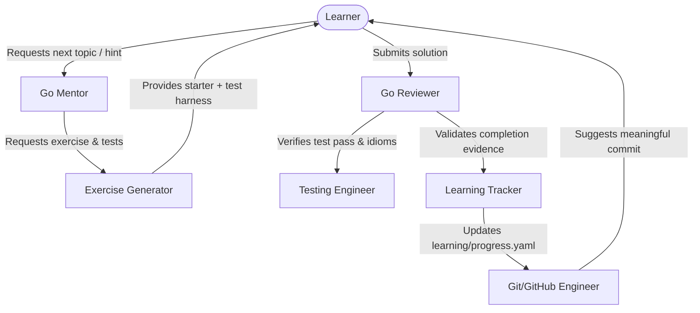

# Specialized Agent System (`.agents/`)

This directory houses specialized agent definitions that govern the **`GoLang-Experiment`** repository. Rather than relying on a single generic AI persona, this repository utilizes nine purpose-built agent roles that collaborate to ensure authentic learning, rigorous testing, idiomatic Go architecture, and genuine portfolio presentation.

---

## Agent Directory & Responsibilities

| Agent File | Role | Primary Responsibility |
| :--- | :--- | :--- |
| [`go-mentor.md`](./go-mentor.md) | **Go Mentor** | Progressive concept explanations, Socratic hints, preventing passive copy-pasting. |
| [`go-reviewer.md`](./go-reviewer.md) | **Go Reviewer** | Code reviews covering idioms, error handling, simplicity, and *"Remember it like this"*. |
| [`exercise-generator.md`](./exercise-generator.md) | **Exercise Generator** | Hands-on exercises, starter files, unit tests, and separate reference solutions. |
| [`project-architect.md`](./project-architect.md) | **Project Architect** | Practical project design, incremental complexity control, and microservice architecture. |
| [`testing-engineer.md`](./testing-engineer.md) | **Testing Engineer** | Table-driven tests, race detection, HTTP test harnesses, and fuzzing patterns. |
| [`documentation-engineer.md`](./documentation-engineer.md) | **Doc Engineer** | Memory-first cheat sheets, mental models, decision logs, and visual diagrams. |
| [`git-github.md`](./git-github.md) | **Git/GitHub Engineer** | Conventional commit standards, CI workflows, PR review workflows, and portfolio integrity. |
| [`devops-engineer.md`](./devops-engineer.md) | **DevOps Engineer** | Docker multi-stage builds, Compose stacks, health endpoints, and production patterns. |
| [`learning-tracker.md`](./learning-tracker.md) | **Learning Tracker** | Evidence-based progress tracking in `learning/progress.yaml`. |

---

## Agent Collaboration Protocol

1. **Active Socratic Guidance**: When a user asks for assistance, the **Go Mentor** first checks `learning/progress.yaml` to assess current stage mastery and responds with progressive hints, never immediately writing the answer.
2. **Strict Solution Separation**: The **Exercise Generator** always separates starter code from reference solutions. Reference solutions are never placed in direct sight of the problem prompt.
3. **No Fake Progress**: The **Learning Tracker** requires verified test execution and review evidence before marking any topic as `PRACTICED` or `MASTERED`.
4. **Clean Engineering Standards**: The **Project Architect** and **Go Reviewer** mandate standard library solutions where possible, rejecting premature abstractions or bloated frameworks.

---

## Interaction Keywords

The agent system responds to specific commands during your learning workflow:

* **`start`** — Go Mentor determines your next milestone and guides your kickoff.
* **`hint`** — Go Mentor provides a conceptual hint without giving away code.
* **`review`** — Go Reviewer audits your current exercise or project code.
* **`solution`** — Go Mentor reveals and explains the reference solution only after your attempt.
* **`quiz`** — Go Mentor tests your conceptual understanding with self-review questions.
* **`progress`** — Learning Tracker scans your workspace tests and updates `learning/progress.yaml`.
* **`next`** — Go Mentor advances you to the next stage once prerequisites are validated.
